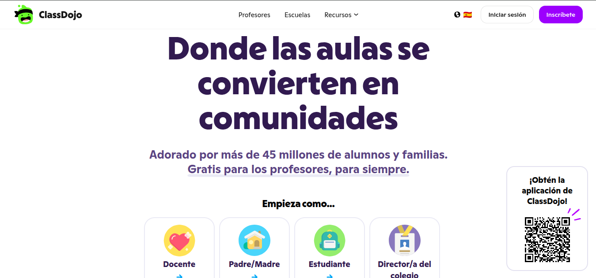

# 🧠 Propuesta TIC: Estrategias Digitales para Estudiantes que No Realizan Producciones Escritas

## 📍 EE N°23 - Escuela de Educación Especial

**Área TIC – Propuesta de acompañamiento docente**

---

## 📌 Introducción

En el contexto educativo actual, nos encontramos con estudiantes que presentan dificultades o rechazo hacia las producciones escritas tradicionales. Sin embargo, muchos de ellos demuestran habilidades, interés y desenvolvimiento en entornos digitales (computadora, celular, aplicaciones, etc.).

Esta propuesta tiene como objetivo brindar a los docentes **estrategias alternativas de evaluación y producción**, aprovechando herramientas digitales, gamificación y metodologías activas.

> ⚠️ Importante:
> Esta NO es una obligación, sino una **guía orientativa** para acompañar trayectorias educativas diversas.

---

## 🎯 Objetivos de la propuesta

* Favorecer la inclusión educativa mediante formatos alternativos
* Motivar a estudiantes con bajo interés en lo tradicional
* Promover el uso de herramientas digitales con sentido pedagógico
* Transformar la evaluación en un proceso más dinámico y significativo

---

# 🚀 1. Producciones con Git, Markdown y Wiki (Nivel inicial–medio)

## 💡 Idea principal

Proponer al estudiante la creación de un **repositorio digital propio**, donde pueda organizar contenidos como si fuera un desarrollador.

## 📦 Posibles actividades:

* Crear un repositorio (GitHub o similar)
* Redactar un `README.md` (presentación personal o del tema)
* Crear una **Wiki** con contenidos
* Registrar avances mediante commits

## 🎯 Enfoque pedagógico:

* Se transforma la tarea en un **desafío técnico**
* Fomenta autonomía y organización
* Permite reducir la escritura tradicional (uso de listas, emojis, estructura simple)

## 🔗 Recursos:

* GitHub: https://github.com
* Markdown Guide: https://www.markdownguide.org
* Guia en Españo Markdown: https://tutorialmarkdown.com/guia

---

# 🎮 2. Herramientas de Gamificación

## 🟣 Kahoot!

  

* Cuestionarios interactivos en formato juego
* Participación desde celular o PC

👉 Ideal para:

* Evaluaciones dinámicas
* Repasos grupales

🔗 https://kahoot.com

---

## 🧠 Cerebriti

  

* Permite que el estudiante **cree sus propios juegos**

👉 Muy útil para:

* Estudiantes que rechazan tareas tradicionales
* Aprendizaje activo

🔗 https://www.cerebriti.com

---

## 🧙 ClassDojo

  
  

* Sistema de puntos, logros y seguimiento
* Refuerzo positivo

🔗 https://www.classdojo.com

---

## 🧩 JClic

  

* Creación de actividades como:

  * Rompecabezas
  * Asociaciones
  * Juegos educativos

🔗 https://clic.xtec.cat

---

# 🎥 3. Alternativas a la Producción en Video

## 🎬 Edpuzzle

  
  

* Permite trabajar sobre videos sin necesidad de grabarse
* El docente inserta preguntas dentro del video

👉 Ideal para:

* Evaluación sin exposición directa
* Seguimiento del aprendizaje

🔗 https://edpuzzle.com

---

# 🧠 4. Producciones sin Escritura Tradicional

## 🎨 Genially

  
  
  

* Creación de:

  * Presentaciones interactivas
  * Infografías
  * Juegos

👉 Permite expresión visual y creativa

🔗 https://genial.ly

---

# 🧑‍💻 5. Nivel Pro: Creación de Juegos

## 🟡 Scratch

  
  
  

* Plataforma para crear juegos y animaciones
* Programación por bloques

👉 Ideal para:

* Estudiantes con perfil lógico o creativo
* Aprendizaje sin escritura formal

🔗 https://scratch.mit.edu

---

# 🧩 6. Propuesta de Actividad (Modelo sugerido)

## 🔥 “Desafío Nivel Experto”

Se propone al estudiante el siguiente reto:

> “Crear su propio sistema digital de aprendizaje utilizando herramientas tecnológicas”

## 📦 Entregables posibles:

* Repositorio digital (GitHub)
* README con presentación
* Producción a elección:

  * Juego (Scratch / Cerebriti)
  * Kahoot creado por el estudiante
  * Presentación interactiva (Genially)

## 🎯 Criterios de evaluación:

* Creatividad
* Uso de herramientas
* Autonomía
* Resolución de problemas

---

# ⚠️ Consideraciones Pedagógicas

* Evitar forzar formatos tradicionales
* Priorizar el interés del estudiante
* Transformar la consigna en desafío
* Brindar acompañamiento gradual

---

# 🏫 Cierre Institucional

Esta propuesta fue desarrollada desde el área TIC de la
**Escuela de Educación Especial N°23**, con el objetivo de brindar herramientas y estrategias que favorezcan la inclusión, la motivación y el aprendizaje significativo de los estudiantes.

Se invita a los docentes a adaptar estas ideas según su contexto, área y grupo.

---

## 🤝 Área TIC – EE23

**Acompañando trayectorias con tecnología**
